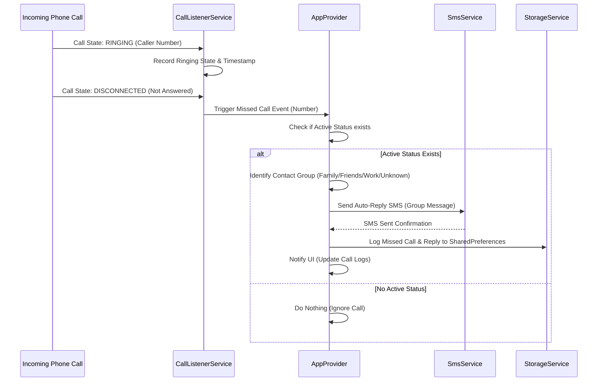

# NowNot — Flutter Architecture Plan

This document outlines the technical architecture for converting the **NowNot** Smart Availability & Missed Call Assistant into a native **Flutter Android application**.

---

## 1. System & Layer Architecture

The Flutter application is structured into four main layers:

```
┌─────────────────────────────────────────────────────────┐
│                    UI Layer (Views & Widgets)           │
│  Onboarding | Dashboard | Status Manager | Call Logs   │
└───────────────────────────┬─────────────────────────────┘
                            │ (Listens to State)
┌───────────────────────────▼─────────────────────────────┐
│                 State Layer (Providers)                 │
│   AppProvider (ChangeNotifier) & Countdown Tickers      │
└──────────────┬───────────────────────────┬──────────────┘
               │ (Calls APIs)              │ (Persists)
┌──────────────▼──────────┐     ┌──────────▼──────────────┐
│     Native Services     │     │     Storage Service     │
│ PhoneState & Telephony  │     │   SharedPreferences     │
└──────────────┬──────────┘     └─────────────────────────┘
               │ (Android System APIs)
┌──────────────▼──────────────────────────────────────────┐
│             Android Native System Layer                 │
│ BroadcastReceiver | TelephonyManager | ForegroundService │
└─────────────────────────────────────────────────────────┘
```

---

## 2. Directory & File Structure

```
nownot_flutter/
├── android/
│   └── app/src/main/
│       └── AndroidManifest.xml       # Declare Android permissions & receiver
├── lib/
│   ├── main.dart                      # App entry point & Provider registration
│   ├── models/
│   │   ├── status_model.dart          # Status object definition
│   │   ├── schedule_model.dart        # Recurring schedule definition
│   │   ├── call_log_model.dart        # Missed call log entry definition
│   │   └── contact_group_model.dart   # Contact group definitions (Family, Friends, etc.)
│   ├── providers/
│   │   └── app_provider.dart          # Core state provider (ChangeNotifier)
│   ├── services/
│   │   ├── storage_service.dart       # SharedPreferences serialization/deserialization
│   │   ├── call_listener_service.dart # Listens to phone ringing/missed state
│   │   ├── sms_service.dart           # Dispatches auto-reply SMS
│   │   └── foreground_service.dart    # Manages persistent Android status bar notification
│   ├── views/
│   │   ├── onboarding_view.dart       # Permission consent & welcome screen
│   │   ├── dashboard_view.dart        # Main dashboard screen
│   │   ├── status_editor_view.dart    # Create / edit status sheet
│   │   └── call_log_view.dart         # Missed call history screen
│   ├── widgets/
│   │   ├── active_status_card.dart    # Live countdown & progress bar widget
│   │   ├── status_tile.dart           # Saved status item
│   │   └── glass_container.dart       # Reusable dark glassmorphic container
│   └── theme/
│       └── app_theme.dart             # Dark color palette & GoogleFonts Outfit
└── pubspec.yaml                       # Dependencies & assets
```

---

## 3. Android Native Permissions & Manifest Configuration

To allow background missed call detection and auto-reply SMS, `android/app/src/main/AndroidManifest.xml` must declare the following permissions:

```xml
<manifest xmlns:android="http://schemas.android.com/apk/res/android">
    <!-- Permissions required for NowNot -->
    <uses-permission android:name="android.permission.READ_PHONE_STATE" />
    <uses-permission android:name="android.permission.READ_CALL_LOG" />
    <uses-permission android:name="android.permission.SEND_SMS" />
    <uses-permission android:name="android.permission.READ_CONTACTS" />
    <uses-permission android:name="android.permission.FOREGROUND_SERVICE" />
    <uses-permission android:name="android.permission.FOREGROUND_SERVICE_SPECIAL_USE" />
    <uses-permission android:name="android.permission.POST_NOTIFICATIONS" />
    
    <application
        android:label="NowNot"
        android:name="${applicationName}"
        android:icon="@mipmap/ic_launcher">
        
        <!-- Foreground Service Registration -->
        <service
            android:name="com.pravera.flutter_foreground_task.service.ForegroundService"
            android:foregroundServiceType="specialUse"
            android:exported="false" />
    </application>
</manifest>
```

---

## 4. Missed Call & SMS Dispatch Flow



---

## 5. Storage Model (`SharedPreferences`)

All local data is stored using `shared_preferences` as serialized JSON strings:

| Storage Key | Type | Contents |
|---|---|---|
| `nownot_statuses` | String (JSON Array) | List of saved custom statuses with group messages |
| `nownot_schedules` | String (JSON Array) | Recurring schedule windows |
| `nownot_active_status` | String (JSON Object) | Currently active status, start/end epoch ms, `isManual` flag |
| `nownot_call_log` | String (JSON Array) | History of missed calls, replies sent, and reminder flags |
| `nownot_contact_groups` | String (JSON Object) | Phone numbers mapped to Family, Friends, Work, or Unknown |

---

## 6. Data Model Schemas (Dart)

### Status Model (`lib/models/status_model.dart`)
```dart
class StatusModel {
  final String id;
  final String name;
  final String emoji;
  final Map<String, String> groupMessages; // {'Family': '...', 'Friends': '...', 'Work': '...', 'Unknown': '...'}

  StatusModel({
    required this.id,
    required this.name,
    required this.emoji,
    required this.groupMessages,
  });

  Map<String, dynamic> toJson() => {
    'id': id,
    'name': name,
    'emoji': emoji,
    'groupMessages': groupMessages,
  };

  factory StatusModel.fromJson(Map<String, dynamic> json) => StatusModel(
    id: json['id'],
    name: json['name'],
    emoji: json['emoji'],
    groupMessages: Map<String, String>.from(json['groupMessages'] ?? {}),
  );
}
```

### Active Status Runtime Model (`lib/models/active_status_model.dart`)
```dart
class ActiveStatusModel {
  final StatusModel status;
  final int startTimeMs;
  final int endTimeMs;
  final bool isManual;

  ActiveStatusModel({
    required this.status,
    required this.startTimeMs,
    required this.endTimeMs,
    required this.isManual,
  });

  bool get isExpired => DateTime.now().millisecondsSinceEpoch >= endTimeMs;
  
  Map<String, dynamic> toJson() => {
    'status': status.toJson(),
    'startTimeMs': startTimeMs,
    'endTimeMs': endTimeMs,
    'isManual': isManual,
  };

  factory ActiveStatusModel.fromJson(Map<String, dynamic> json) => ActiveStatusModel(
    status: StatusModel.fromJson(json['status']),
    startTimeMs: json['startTimeMs'],
    endTimeMs: json['endTimeMs'],
    isManual: json['isManual'],
  );
}
```

---

## 7. Key Flutter Invariants

1. **Strict Active Status Isolation**: Auto-SMS dispatch must **only** execute if `ActiveStatusModel` is non-null and `isExpired` is false.
2. **Manual Status Precedence**: If a manual status is activated, scheduled status checks are bypassed until the manual status naturally expires.
3. **Foreground Service Requirement**: On Android, the background call listener must run within a registered Foreground Service showing a status bar notification (e.g. *"😴 Sleeping until 5:00 PM"*). This prevents the Android OS from killing the app process during long sleep/meeting periods.
4. **Graceful Permission Degradation**: If the user denies `SEND_SMS` or `READ_CALL_LOG` permission, the UI must clearly display an alert banner explaining that auto-replies cannot be dispatched until permissions are granted in Android Settings.
